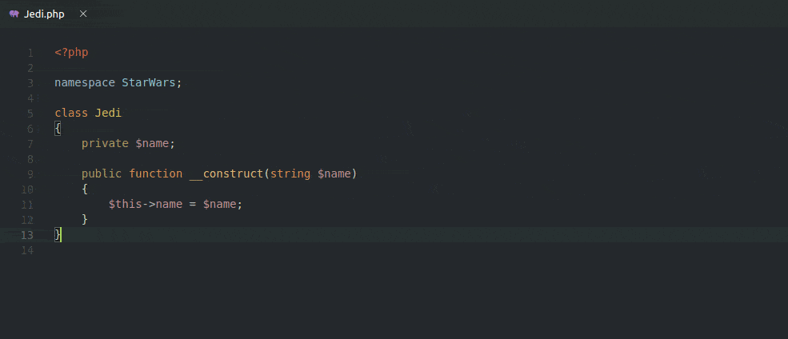
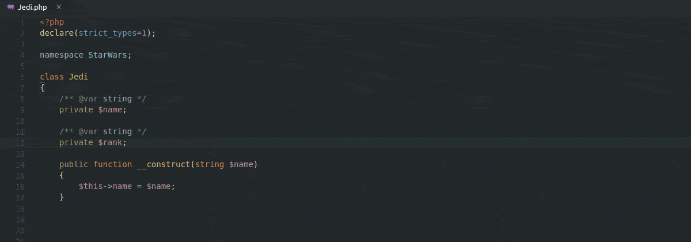
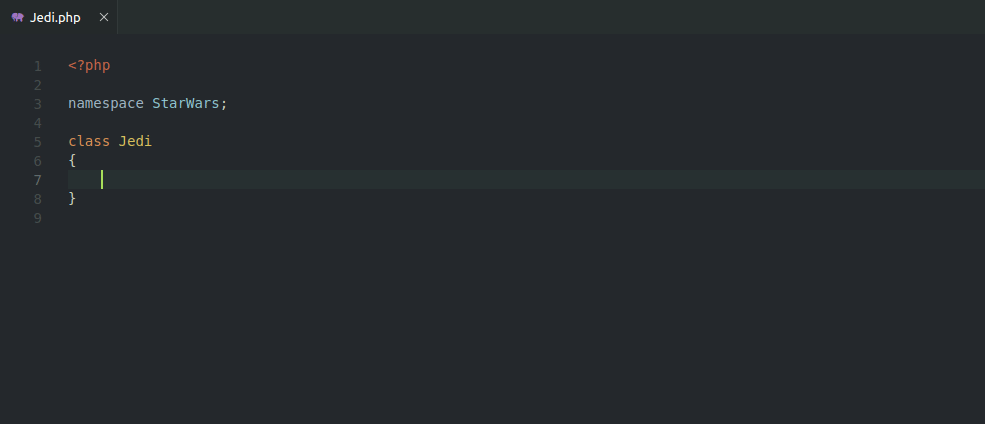
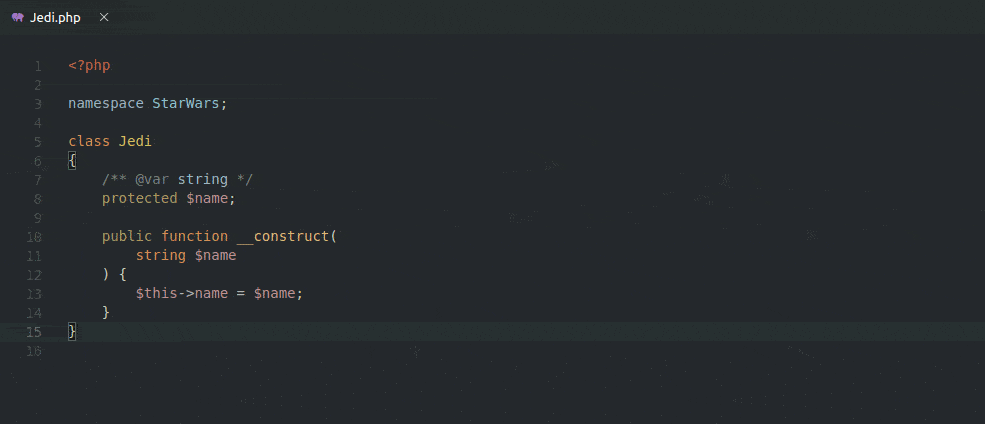
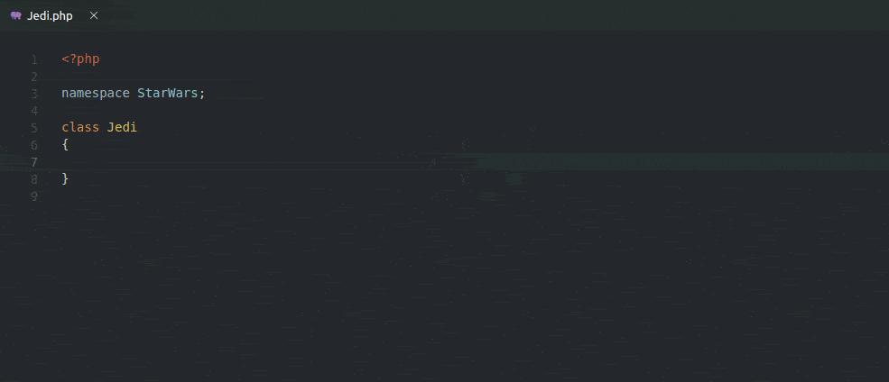

# PHP Add Property

Visual Code Studio extension to quickly add PHP class properties

## Features

### Add a property

### Add existing properties

> It gets the property type from the docblock!

### Insert constructor

Automatically insert a constructor if it does not exist.

### Multi-line constructor support

### Highly customizable

## Extension Settings

This extension contributes the following settings:

* `phpAddProperty.property.visibility.choose`: Specifies whether to choose property visibility when inserting
* `phpAddProperty.property.visibility.default`: Specifies the default property visibility
* `phpAddProperty.property.stopToImport`: Specifies whether to stop after typing the type to refer to an external fully qualified name with an alias or importing
* `phpAddProperty.property.docblock.add`: Specifies whether to add a docblock @var type to the property
* `phpAddProperty.property.docblock.multiline`: Specifies whether to use a multiline docblock
* `phpAddProperty.property.docblock.withParameter`: Specifies whether to add the docblock @var type to the property and the constructor parameter type at the same time
* `phpAddProperty.property.docblock.stopToImport`: Specifies whether to stop after typing the type to refer to an external fully qualified name with an alias or importing
* `phpAddProperty.property.types`: Specifies whether to enable PHP 7.4+ typed properties [More info](https://wiki.php.net/rfc/typed_properties_v2)
* `phpAddProperty.constructor.visibility.choose`: Specifies whether to choose constructor visibility when inserting
* `phpAddProperty.constructor.visibility.default`: Specifies the default constructor visibility
* `phpAddProperty.constructor.breakIntoMultilineIfLengthExceeded.enabled`: Specifies whether to break the constructor into multiple lines if the given line length is exceeded
* `phpAddProperty.constructor.breakIntoMultilineIfLengthExceeded.maxLineLength`: Specifies the maximum line length before using a multiline constructor
* `phpAddProperty.showMessagesOnStatusBar`: Specifies whether to show messages on status bar instead of notification box
* `phpAddProperty.showContextMenuOptions`: Specifies whether to show the context menu options
