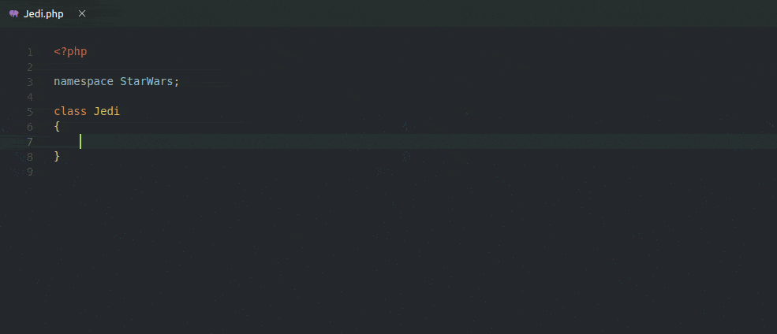

# PHP Add Property

Visual Code Studio extension to quickly add PHP class properties

## Features

### Add a property

### Insert constructor

Automatically insert a constructor if it does not exist.

### Multi-line constructor support

### Highly customizable

## Extension Settings

This extension contributes the following settings:

* `phpAddProperty.property.visibility.choose`: Specifies whether to choose property visibility when inserting
* `phpAddProperty.property.visibility.default`: Specifies the default property visibility
* `phpAddProperty.property.stopToImport`: Specifies whether to stop after typing the type to refer to an external fully qualified name with an alias or importing
* `phpAddProperty.property.docblock.add`: Specifies whether to add a docblock @var type to the property
* `phpAddProperty.property.docblock.withParameter`: Specifies whether to add the docblock @var type to the property and the constructor parameter type at the same time
* `phpAddProperty.property.docblock.stopToImport`: Specifies whether to stop after typing the type to refer to an external fully qualified name with an alias or importing
* `phpAddProperty.property.types`: Specifies whether to enable PHP 7.4+ typed properties [More info](https://wiki.php.net/rfc/typed_properties_v2)
* `phpAddProperty.constructor.visibility.choose`: Specifies whether to choose constructor visibility when inserting
* `phpAddProperty.constructor.visibility.default`: Specifies the default constructor visibility
